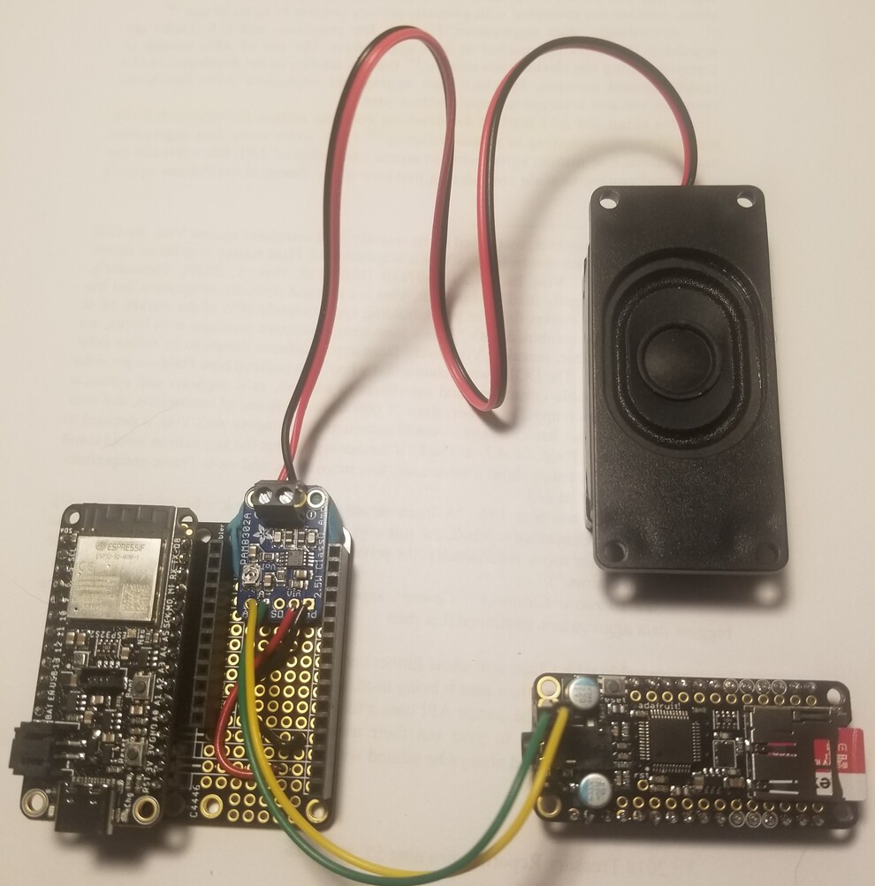

# Chime : A Home Assistant Siren Implementation #

## Description ##

The **Chime** is the second half of the smart doorbell project. However, the Chime (or Siren in Home Assistant nomanclature) can exist independently of the Doorbell. Any home automation task that can benefit from an alarm or audio annoucement and display some status information would find a use for the Chime.

The doorbell essentially provides a button to trigger an action in Home Assistant. Through the magic of some scripted automation, HA then commands the Chime to make a doorbell sound. The doorbell and chimer are two separate independent projects which rely on HA to work together.

Of course, the chime need not be limited to doorbell only activities. Since it can play a variety of tones, or in fact any audio file, the Chime can also be used as a fire/smoke alarm and security siren. It can even welcome you home if you're using presence detection. 

_This project will detail the build of the Chime, a Home Assistant Siren implementation._





## Parts List ##
| Component | Description |
| -- | -- |
| [Adafruit ESP32-S2 Feather with BME280](https://www.adafruit.com/product/5303) | An ESP32-S2 with 4MB Flash and 2MB PSRAM on a Feather format breakout. The BME280 temperature/humidity/pressure sensor is not necessary |
| [Adafruit MusicMaker Featherwing](https://www.adafruit.com/product/3357) | A Feather format breakout for the VS1053B, an encoding/decoding (codec) chip that can decode a wide variety of audio formats such as MP3, AAC, Ogg Vorbis, WMA, MIDI, FLAC, WAV (PCM and ADPCM) | 
| [FeatherWing Doubler](https://www.adafruit.com/product/2890) | Not strictly necessary since the two above Feather-formatted boards can be stacked on top of each other. However the FeatherWing Doubler with its side-by-side layout just allows easier access to buttons and SD card |
| [Adafruit Grayscale 1.5" 128x128 OLED Display](https://www.adafruit.com/product/4741)|An I2C enabled OLED 128x128 pixel display|
| [Adafruit Mono 2.5W Class D Audio Amplifier - PAM8302](https://www.adafruit.com/product/2130) | A 2.5 watt audio amplifier. |
| [Mono Enclosed Speaker - 3W 4 Ohm](https://www.adafruit.com/product/3351) | A simple speaker |

### Pin Mapping ###
When both the microcontroller and codec are on Feather breakouts, you simply stack one on top of the other and all the proper pins align. However, in case you don't have the convenience of having both components in a Feather breakout format, the pin connections between the microcontroller and codec are specified below:
| ESP32-S2 GPIO pins | MusicMaker IO pins | DEFINE (chime.h) | PAM8302 |
| -- | -- | -- | -- |
| 10 | XDCS (command/data select) | VS1053_DCS | |
| 9 (hardware interrupt capable pin - they all are on the ESP32)| DREQ (data request) | VS1053_DREQ | |
| 6 | VS1053 select | VS1053_CS | |
| 5 | SDCS (sdcard select) | CARDCS | |
| 36 (SCK) | SCK | | |
| 35 (MO) | MOSI | | |
| 37 (MI) | MISO | | |
| | G(round) near headphone jack | | A- |
| | R(ight) near headphone jack | | A+ |

## Assembly ##
Placing the ESP32-S2 Feather and MusicMaker onto the FeatherWing Doubler as well as plugging in the I2C display is all plug-and-go.
I should have bought the [version of the MusicMaker without the headphone jack](https://www.adafruit.com/product/3436) that can be connected directly to speakers (if you use this, you can forego the separate PAM8302 amplifier). As a work-around, I added the PAM8302 based audio amplifier which as you can see from the photos is blue-tacked beneath the MusicMaker, connected to 3.3V and ground as well as one of the channel outputs (to support stereo another PAM8302 amplifier and speaker would be required).

## SDCard ##
Format as FAT16 or FAT32. Create a directory to store all the tones you intend on using. The filenames will need to be in 8.3 format. The default directory is /tones (defined in chime.h). This directory should *ONLY* contain audio files that are compatible with the VS1053B codec (Ogg Vorbis, MP3/MP2/MP1, MP4, AAC, WMA, FLAC, WAV (PCM and ADPCM)). 

## MQTT Discovery ##
The Chime publishes several MQTT discovery messages upon startup.
The main one describes the [**siren**](https://www.home-assistant.io/integrations/siren.mqtt/) entity, providing the command topic to send messages to for activation/deactivation. Siren features such as duration, volume and available tones are also defined.
Available tones is dynamically populated with all files found in the /tones directory on the SD card. Calling the Siren service in Home Assistant will only allow one of the available tones to be set. 

### Siren: ###
Discovery topic: homeassistant/siren/featheresp32s2/chime/config
```
{
  "entity_category": "config",
  "unit_of_measurement": "",
  "availability_topic": "homeassistant/siren/featheresp32s2/availability",
  "unique_id": "featheresp32s2_chime",
  "device": {
    "name": "Chime",
    "identifiers": "84:F7:03:D6:8B:20",
    "mf": "Adafruit",
    "mdl": "Feather ESP32-S2 with BME280",
    "sw": "20230304.1700"
  },
  "name": "featheresp32s2 chime",
  "icon": "mdi:bullhorn",
  "state_topic": "homeassistant/siren/featheresp32s2/state",
  "command_topic": "homeassistant/siren/featheresp32s2/command",
  "optimistic": false,
  "support_duration": false,
  "support_volume_set": true,
  "available_tones": [
    "alarm.mp3",
    "alarm.wav",
    "bell.wav",
    "doorbell.wav",
    "siren001.wav",
    "siren002.wav",
    "siren003.wav"
  ]
}
```
Note that the "featheresp32s2" part of all the topics can be changed by editing DEVICE_ID in chime.h

### Text: ###
The [**text**](https://www.home-assistant.io/integrations/text.mqtt/) integration was just recently (Dec 2022) introduced. Be sure to update Home Assistant for support.

Discovery topic: homeassistant/text/featheresp32s2/display/config
```
{
  "entity_category": "config",
  "unit_of_measurement": "",
  "availability_topic": "homeassistant/siren/featheresp32s2/availability",
  "unique_id": "featheresp32s2_display",
  "device": {
    "name": "Chime",
    "identifiers": "84:F7:03:D6:8B:20",
    "mf": "Adafruit",
    "mdl": "Feather ESP32-S2 with BME280",
    "sw": "20230317.0900"
  },
  "name": "featheresp32s2 display",
  "icon": "mdi:image-text",
  "state_topic": "homeassistant/text/featheresp32s2/display/state",
  "command_topic": "homeassistant/text/featheresp32s2/display/command",
  "command_template": "{ 'text': '{{ value }}', 'graphic': 'NONE' }",
  "value_template": "{{ value_json.text }}"
}
```

Chime publishes some diagnostic information periodically, namely wifi related details such as RSSI value (measurable), IP and MAC addresses (static) to the topic *homeassistant/siren/featheresp32s2/diagnostics*

The diagnostic message is simply:
```
{
  "wifi_rssi": -50,
  "wifi_ip": "10.0.0.177",
  "wifi_mac": "84:F7:03:D6:8B:20",
  "last_boot": "2023-03-17T12:42:13-0400"
}
```

The MQTT discovery message for RSSI looks like this:
```
{
  "state_class": "measurement",
  "entity_category": "diagnostic",
  "availability_topic": "homeassistant/siren/featheresp32s2/availability",
  "unique_id": "featheresp32s2_wifi_rssi",
  "device": {
    "name": "Chime",
    "ids": "84:F7:03:D6:8B:20"
  },
  "name": "featheresp32s2 wifi_rssi",
  "icon": "mdi:wifi-strength-2",
  "state_topic": "homeassistant/siren/featheresp32s2/diagnostics",
  "value_template": "{{ value_json.wifi_rssi }}"
}
```
(last boot, IP and MAC discovery messages not shown)

The **refresh rate** is the frequency (in minutes) what the diagnostic information is updated.
The refresh rate can be set and it is made discoverable through the following message:

```
{
  "entity_category": "config",
  "unit_of_measurement": "minutes",
  "availability_topic": "homeassistant/siren/featheresp32s2/availability",
  "unique_id": "featheresp32s2_refreshrate",
  "device": {
    "name": "Chime",
    "identifiers": "84:F7:03:D6:8B:20",
    "mf": "Adafruit",
    "mdl": "Feather ESP32-S2 with BME280",
    "sw": "20230304.1700"
  },
  "name": "featheresp32s2 refreshrate",
  "icon": "mdi:refresh-circle",
  "state_topic": "homeassistant/number/featheresp32s2/refreshrate/get",
  "command_topic": "homeassistant/number/featheresp32s2/refreshrate/set",
  "min": 1,
  "max": 60,
  "step": 1
}
```

# Usage #

Once configured, the Chime should announce itself to Home Assistant without any further effort and be ready to incorporate into your automation scripts.

1. Copy sample-env.h to env.h and customize env.h and chime.h to match your environment.
2. (Optional) #define DISABLE_SERIAL_OUTPUT 1 in log.h to disable all serial logging. Best to keep logging enabled until everything is confirmed working. 
3. Compile and upload firmware to your device.
4. Format an SDcard with FAT16 or FAT32. Create a directory named **/tones** and copy some mp3 or wav files (using 8.3 filenames) into the directory. Insert the SDcard into the MusicMaker.
5. Power on device. Confirm through MQTT explorer that new discovery topics exist and that device is visible to Home Assistant.
6. Using *Home Assistant > Developer Tools > Services*, activate the siren. Note that only a tone listed in **available_tones** in the siren discovery message is allowed.


7. Alternatively publishing a message to MQTT will also turn the siren on and off: 
   
   *homeassistant/siren/featheresp32s2/command*
   ```
   {"state": "ON", "tone": "alarm.mp3", "volume_level": 0.5}
   {"state": "OFF"}
   ```
   where **volume_level** is a number between 0..1

   Received commands are reflected back to the state topic: 
   *homeassistant/siren/featheresp32s2/state*
  
8. The display is updated independently of the Siren.
 
  [Supported graphics](include/graphics.h) are: 
  | Label | Suggested Purpose | Graphic |
  | -- | -- | -- |
  | FIRE | Fire or smoke alarm | |
  | WATER | Water leak |  |
  | CO2 | Unsafe carbon dioxide levels |  |
  | GAS | Unsafe gas detected |  |
  | AQI | Dirty air/particulate levels unsafe |  |
  | ALERT | General alert |  |
  | DOOR | Doorbell ringer |  |
  | GARAGE | Garage door ajar |  |
  | INFO | Informational |  |
  | RADS | Unsafe radiation levels |  |
  | SAFE | Security alert |  |
  | FREEZE | Freeze warning |  |

   *homeassistant/text/featheresp32s2/display/command*
   ```
    {"text": "Master bedroom carbon dioxide levels too high!", "graphic": "CO2" }

    {"text": "", "graphic": "NONE" } (for a blank screen)

    {"text": "...", "graphic": "MEDIUM_TEXT" } (for 10 characters, 6 lines)

    {"text": "...", "graphic": "LARGE_TEXT" } (for 7 characters, 5 lines)
   ```
## Customizing Graphics ##

1. Find something a [Material Design Icon](https://pictogrammers.com/library/mdi/) you like.
2. Edit the icon, by sizing it (remember the display maximum is 128x128) and setting a solid black background and white foreground colors.
   
   
3. Once the graphic is created and available locally, you can upload it to a [website](https://notisrac.github.io/FileToCArray/) that will create a binary array for you.


  
  The resulting output can be pasted directly into the [code](include/graphics.h).

## Home Assistant Integration ##

Of course the Chime integrates with HA using MQTT Discovery messages. However this section discusses how HA acts as the glue between the doorbell and the chime, so that pressing the doorbell button ultimately results in a ring tone sounded by the chime. 
The doorbell project captures a photo and uploads it to HA. This state update can be used as a trigger for an HA automation. Notice that the action associated with this trigger is a script.

In **automations.yaml**:
```

- id: "DOORBELL_ACTIVATED"
  alias: "Doorbell activated"
  description: "Trigger doorbell tone on Siren when Doorbell activated"
  trigger:
    - entity_id: camera.doorbell_snapshot      
      platform: state
      attribute: file_path # trigger on any change to attribute
  condition: []
  action:
    service: script.doorbell_activated
```

The script can be thought of as simply a macro for some grouped activities.

In **scripts.yaml**:
```
doorbell_activated:
  alias: Doorbell pressed
  icon: mdi:doorbell
  description: Plays the doorbell tone and displays the doorbell message, cleared
    after 1 minute
  mode: queued
  max: 5
  max_exceeded: info
  sequence:
  - alias: Display doorbell ringing message
    service: mqtt.publish
    data:
      topic: homeassistant/text/featheresp32s2/display/command
      retain: false
      payload: '{"text":"Somebody is at the   front door", "graphic": "DOOR" }'
  - alias: Play doorbell tone
    service: mqtt.publish
    data:
      topic: homeassistant/siren/featheresp32s2/command
      retain: false
      payload: '{"state":"ON", "tone": "doorbell.wav", "volume_set": 0.75 }'
  - alias: Doorbell notification
    service: notify.notify
    data:
      message: Doorbell rung!
  - alias: Wait
    delay:
      minutes: 1
  - alias: Clear display
    service: mqtt.publish
    data:
      topic: homeassistant/text/featheresp32s2/display/command
      retain: false
      payload: '{"text":"", "graphic": "NONE" }'
  ```
### Sequence Diagram ###

This sequence illustrates how both the Doorbell project and Chime project work together through Home Assistant automation. 


Generated using [PlantUML](https://www.plantuml.com/plantuml/png/rLLHRzis47xdhpYes5jZfUtQ3KONj5qoD6WJ5sqmO801WPBE4bkHLCYJFIF9Vnz9IL6apKk303Ec9_FutTrttntFRonnGusi6ECPQGFjzxkmOZY5ZrjOjrPMEnUHYPehWcEjJOfLDKRcdNK4ZTvhYV3MMc79dQCMMd9ssM23dNDqfkrb8uWql3Fw6vh8W-GbqIZMhwMGpcL2CFFM4QxMkfefgcVQ50FE6KAzOiq97GDuKecYfCBmxM0EmUxUiAv-E3YwBH3cK1kq5jB6KLR0b7Qknlimlk7V45P6Ix0LOirGvU3lRtCCOPuOp1dhZvCCX9OWvKHejhimNxLGi14hmTZrzVK8vQfrW089iiOOL0JaPVBcWt6GqRqBCsPKSWTvdHurTQLv3bzhB9PggTvVN7o2Juil5n3pMiGISy4JgnkJOLpfZ5VzeVLRgXQHQKKkLoBoNuBXe4NDut64rsSdnwTla-FJpyc7ap-EujbTXJicGl82WJGR3nYS-K1-Z3OMpQ0-A_cqyEU7Xx3ui5HNqPHSD8yUHA-t_7RwyUGekl4gxX0nzmFWY9B88ECI3Gyd_0TD7VsroD1sUgv4XN4R8FnEQawb8m-Huone6sX3r0QTzTaJgtXjIqtHKuXktJmmTkMkH15lDfkuHn_qQ3kfQAo_vz2nPu4zR0ILe703BBHba7sNwlT8r0_-Rd6ytJgDbDLcgBPpypqD25VepwzcFxdQtOKHQUESelbLj3B2KQosYUBIWwBRZVQkI_mHrrX5JvSgQfIWHAyIYTms1YKgyXu_U4M54z4VP2xcNUw3buV-nfyIkNQNBrw-yWHIhScDM1Eyd_q8DpUxnSdnRyk2jIseS4Nk6klfTWa3tkl86zAIaz1EE5TsKQ2nIsKp8seQhy2qQh1tzVksRKBTf9Mm9UJ2rXNVGgQbv2htVIYrHDu_jfZmJufNoAb4WxP-yTm-Zpkd-DRfogFcqHVdcUfy2y829w0oh4b5eKGlMM5uNOeij6En-1p13MEUa-VMxkL0pZQfhoJ5_TER_cqK1b7TVIizGv-2kMpG1Hdwvjz1yFxt3eHfVbY1mULnwkSuhd3eHycdpTWhKwVYpY4Ep7VFY1K6rPHPZnxsIBGuzxb9A_I9-sSvs_2rjwzrrKXCB8RNFJjqdEuPtdtHkdTcGnTzmEyUqlOgCFhEGWBsKMKyQ3RtGd0scpq3ALJZrpOdDCxm7wtQoIivNvoVF7wRFfx1_sfXxgZW8NEt1p9JmmXISiRUE24RMVq5)

**PlantUML for Sequence Diagram**
```
@startuml

actor       Visitor            as visitor
participant Doorbell           as doorbell
participant "Home Assistant"   as ha
queue       "Mosquitto Broker" as mqtt
participant Chime              as chime
participant pool.ntp.org       as ntp

activate ha #lightgray
activate chime #lightgray

visitor -> doorbell : press button 
note right
awake from sleep
end note
activate doorbell #red

doorbell -> doorbell : test battery
doorbell -> doorbell : join wifi

|||
doorbell -> ntp : get current time
ntp --> doorbell : current time
|||

doorbell -> ha : <b>upload jpeg\n\nHTTP POST /api/media_source/local_source/upload\nmedia_content_id=media-source://media_source/<MEDIA_DIR_KEY>/.
note right
upload image to
Home Assistant Media Browser
end note

ha --> doorbell : 200 OK\n{"media_content_id":"media-source://media_source/<MEDIA_DIR_KEY>/./<MEDIA_FILE>"}
|||
doorbell -> ha : <b>update static camera state\n\nHTTP POST /api/services/local_file/update_file_path\n{ "entity_id": "camera.doorbell_snapshot", "file_path": "/config/www/doorbell-snapshots/<MEDIA_FILE>"}
note right
update camera
state with new 
image
end note
ha --> doorbell : 200 OK
|||
doorbell -> ha : <b>update battery state\n\nHTTP POST /api/states/sensor.doorbell_battery\n{"state": 86.7, "attributes":{"friendly_name": "Doorbell Battery Level",\n"unit_of_measurement": "%", "icon": "mdi:battery-50", "batt_mv": 3567, "boot_count": 14 }}
ha --> doorbell : 200 OK
deactivate doorbell

note left
deep sleep
end note


ha -> ha : automation\ntriggers\nscript
activate ha #blue

ha -> mqtt : <b>publish display command\n\nhomeassistant/text/featheresp32s2/display/command\n{text:"Somebody is at the front door", "graphic": "DOOR" }

mqtt -> chime : <b>subscribe display command\n\nhomeassistant/text/featheresp32s2/display/command\n{text:"Somebody is at the front door", "graphic": "DOOR" }
activate chime #green
note right
display text
and graphic
end note
|||
chime -> mqtt : <b>publish display state\n\nhomeassistant/text/featheresp32s2/display/state\n{text:"Somebody is at the front door", "graphic": "DOOR" }

deactivate chime

mqtt -> ha : <b>subscribe display state\n\nhomeassistant/text/featheresp32s2/display/state\n{text:"Somebody is at the front door", "graphic": "DOOR" }
|||
ha -> mqtt : <b>publish chime command\n\nhomeassistant/siren/featheresp32s2/command\n{"state":"ON", "tone": "doorbell.wav", "volume_set": 1.0 }


mqtt -> chime : <b>subscribe chime command\n\nhomeassistant/siren/featheresp32s2/command\n{"state":"ON", "tone": "doorbell.wav", "volume_set": 1.0 }
activate chime #green
note right
play tone
end note
|||
chime -> mqtt : <b>publish chime state\n\nhomeassistant/siren/featheresp32s2/state\n{"state":"ON", "tone": "doorbell.wav", "volume_set": 1.0 }

deactivate chime

mqtt -> ha : <b>subscribe chime state\n\nhomeassistant/siren/featheresp32s2/state\n{"state":"ON", "tone": "doorbell.wav", "volume_set": 1.0 }

...1 minute later...

ha -> mqtt : <b>publish display command\n\nhomeassistant/text/featheresp32s2/display/command\n{text:"", "graphic": "NONE" }

mqtt -> chime : <b>subscribe display command\n\nhomeassistant/text/featheresp32s2/display/command\n{text:"", "graphic": "NONE" }
activate chime #green
note right
display text
and graphic
end note
|||
chime -> mqtt : <b>publish display state\n\nhomeassistant/text/featheresp32s2/display/state\n{text:"", "graphic": "NONE" }

deactivate chime

mqtt -> ha : <b>subscribe display state\n\nhomeassistant/text/featheresp32s2/display/state\n{text:"", "graphic": "NONE" }

deactivate chime
deactivate chime

deactivate ha

@enduml
```

## Display Continuous Updates ##

Rather than only show alerts or events (like a doorbell press), Chime can also be used to continuously display sensor updates.
In this example, environmental sensors from the [AirMonitor project](https://github.com/g8keeperzuul/AirMonitor) are displayed on Chime as they are updated.
The Chime display is updated via a message published to MQTT with the various sensor values used as parameters to the message body.

```
alias: Update Chime on Air Monitor
description: Display Air Monitor (featherM0) status on Chime
trigger:
  - platform: state
    entity_id:
      - sensor.featherm0_aqi
      - sensor.featherm0_carbon_dioxide
      - sensor.featherm0_humidity
      - sensor.featherm0_pressure
      - sensor.featherm0_temperature
condition: []
action:
  - service: mqtt.publish
    data:
      qos: 0
      retain: false
      topic: homeassistant/text/featheresp32s2/display/command
      payload: >-
        { "text": "{{states('sensor.featherm0_temperature')|round(1)}}
        C\n{{states('sensor.featherm0_humidity')|round(1)}}
        RH%\n{{states('sensor.featherm0_pressure')|round()}} hPa\n\nCO2:
        {{states('sensor.featherm0_carbon_dioxide')}}\nAQI:
        {{states('sensor.featherm0_aqi')}}", "graphic": "MEDIUM_TEXT" }
mode: single
```

## Future Enhancements ##

1. Automatically clear the display after a specified duration. Default would be to display forever.
2. Loop play for duration (which is already a supported parameter for 'siren').
3. Center-justify text.